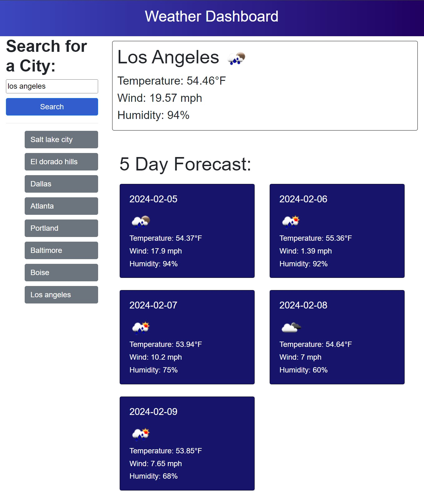

# weather-dashboard
Weather Dashboard utilizing server-side weather API. Third-party APIs allow developers to access their data and functionality by making requests with specific parameters to a URL. This project was to practice working with API's by building a weather dashboard that will run in the browser and feature dynamically updated HTML and CSS. ALso features uses of local storage for user search history and data persistance. 

Uses the [Open Weather API](https://openweathermap.org/forecast5) to retrieve weather data for cities. 

## User Story

```md
AS A traveler
I WANT to see the weather outlook for multiple cities
SO THAT I can plan a trip accordingly
```

## Acceptance Criteria

```md
GIVEN a weather dashboard with form inputs
WHEN I search for a city
THEN I am presented with current and future conditions for that city and that city is added to the search history
WHEN I view current weather conditions for that city
THEN I am presented with the city name, the date, an icon representation of weather conditions, the temperature, the humidity, and the the wind speed
WHEN I view future weather conditions for that city
THEN I am presented with a 5-day forecast that displays the date, an icon representation of weather conditions, the temperature, the wind speed, and the humidity
WHEN I click on a city in the search history
THEN I am again presented with current and future conditions for that city
```

## Example



## Link
A link to the deployed application: https://jmpre28.github.io/weather-dashboard/
